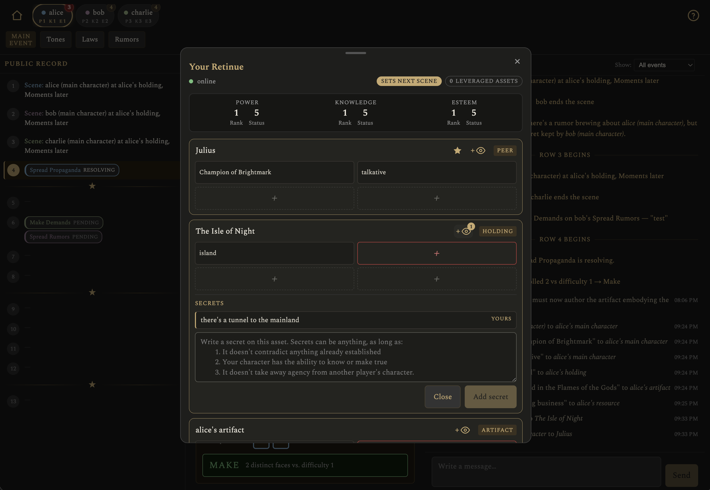

# Uneasy Lies the Head

A web adaptation of *[Uneasy Lies the Head](https://adambell.itch.io/uneasy-lies-the-head-2e)*,
a 2-5 player competitive GMless tabletop RPG set in a royal court. 

Players each control a noble and their retinue, scheming and allying their way
toward a climactic finale. No winner, just a dramatic story everyone told together. 

Designed for both desktop and mobile browsers, 
and both real-time and "play by post" styles: make your move, 
then come back whenever the next player has made theirs.

**Play it now at [uneasy.up.railway.app](https://uneasy.up.railway.app).**



## Attribution

*Uneasy Lies the Head* was designed by [Adam Bell](https://adambell.games/).
This digital adaptation was published with permission from the author. If you want the original
tabletop rules, [buy the book on itch.io](https://adambell.itch.io/uneasy-lies-the-head-2e).

## Quick start

You need Docker Desktop.

```bash
docker compose up
```

Open http://localhost:8080, sign up, and start a table. See
[docs/DEVELOPMENT.md](docs/DEVELOPMENT.md) for the full dev setup (Go/Node
toolchains, tests, sqlc, dev-login shortcuts) and
[docs/OPERATIONS.md](docs/OPERATIONS.md) for running/administering a live
instance.

## License

The code in this repository is [MIT licensed](LICENSE). *Uneasy Lies
the Head* itself — its rules, mechanics, plan and card names, setting,
and example text — is Adam Bell's intellectual property and is used
here with his personal permission; that permission covers this project
only. The MIT license does not extend to the game content. See
[NOTICE](NOTICE) for details.
